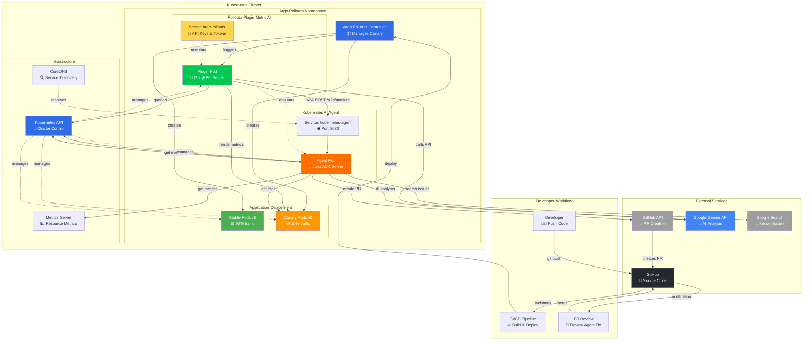

## Canary Analysis Process Flow

This diagram shows the complete flow from canary deployment through AI analysis to automated PR creation:

```mermaid
flowchart TD
    Start([Argo Rollouts Canary Deployment]) --> Canary[Deploy Canary v2<br/>alongside Stable v1]
    Canary --> Traffic[Route Traffic<br/>10% to Canary<br/>90% to Stable]
    Traffic --> Analysis[Argo Rollouts Analysis<br/>runs Analysis Template]
    
    Analysis --> Plugin{Metric AI Plugin<br/>argoproj-labs/metric-ai}
    
    Plugin --> Monitor[Monitor Metrics:<br/>- Success Rate<br/>- Error Count<br/>- Response Time]
    
    Monitor --> Threshold{Metrics<br/>Meet Threshold?}
    
    Threshold -->|Yes| Success[Return: Success<br/>Promote Canary]
    Threshold -->|No| AIAnalysis[Call AI Mode<br/>Ask Gemini to analyze]
    
    AIAnalysis --> GatherData[Gather Context:<br/>- Pod logs<br/>- K8s events<br/>- Metrics data<br/>- Rollout info]
    
    GatherData --> DecideMode{AI Decision:<br/>Use Agent?}
    
    DecideMode -->|"Yes (complex)"| A2ACall[Agent-to-Agent Call<br/>POST /a2a/analyze]
    DecideMode -->|"No (simple)"| DirectAI[Direct Gemini Analysis]
    
    A2ACall --> K8sAgent[Kubernetes AI Agent<br/>in cluster]
    
    K8sAgent --> AgentTools[Agent uses tools:<br/>1. debug_kubernetes_pod<br/>2. get_pod_logs<br/>3. get_kubernetes_events<br/>4. get_pod_metrics<br/>5. inspect_kubernetes_resources]
    
    AgentTools --> AgentAnalyze[Agent analyzes with<br/>Gemini 2.0 Flash]
    
    AgentAnalyze --> SearchKnown[Search Google for<br/>known issues]
    
    SearchKnown --> RootCause[Identify Root Cause]
    
    RootCause --> NeedsFix{Code Fix<br/>Needed?}
    
    NeedsFix -->|Yes| CreatePR[create_github_pr tool:<br/>1. Clone repo<br/>2. Create branch<br/>3. Apply fixes<br/>4. Commit & push<br/>5. Create PR]
    
    NeedsFix -->|No| Recommend[Provide<br/>Recommendations]
    
    CreatePR --> PRCreated[GitHub PR Created<br/>with analysis]
    Recommend --> Response
    PRCreated --> Response
    
    DirectAI --> Response[Return Analysis Response:<br/>- Root Cause<br/>- Promote Decision<br/>- Confidence Level<br/>- PR Link if created]
    
    Response --> PluginDecision{Plugin Decision}
    
    PluginDecision -->|Promote| Promote[Promote Canary<br/>to 100%]
    PluginDecision -->|Abort| Abort[Abort Rollout<br/>Rollback to Stable]
    
    Success --> Promote
    
    Promote --> Complete([Deployment Complete])
    Abort --> Complete
    
    style Start fill:#e1f5e1
    style Complete fill:#e1f5e1
    style K8sAgent fill:#fff3cd
    style Plugin fill:#d1ecf1
    style CreatePR fill:#f8d7da
    style PRCreated fill:#d4edda
    style AgentTools fill:#cfe2ff
```

## System Architecture

This diagram shows all the components, services, and their interactions:

